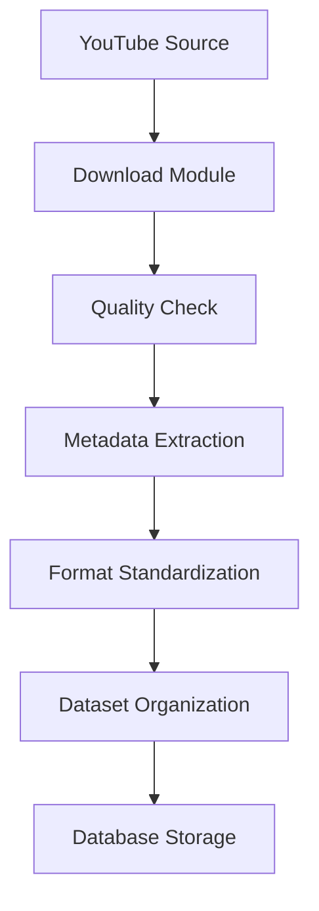

# MAESTRO.ai - Phase 1: Data Pipeline & Preprocessing

## Overview
Phase 1 implements a robust data collection and preprocessing pipeline for audio processing. This phase focuses on gathering high-quality audio data, standardizing formats, and preparing the dataset for further processing.

## How to Setup the Configuration File

1. **Create `config.json`**:
    - In your project directory, create a file named `config.json`.
    - Paste the provided JSON structure into the file. 

2. **Populate Paths**:
    - Adjust the `paths` section:
        - `downloads_dir`: Path to your directory where raw audio files will be downloaded.
        - `dataset_dir`: Path for storing processed dataset files.
        - `features_dir`: Directory to save extracted features.
        - `processed_dir`: Path to save processed audio files.
        - `temp_dir`: Temporary directory for intermediate files.

3. **Set Download Settings**:
    - Fill out the `download_settings` section with the URLs of the YouTube playlists and their respective genres and tags.
    - Set `skip_existing` to `true` if you want to avoid downloading duplicates.
    - Choose an `audio_format` like `"bestaudio/best"` and set the `audio_codec` to `"mp3"`.
    - Enable or disable `include_metadata` fields like `title`, `artist`, `album`, `track`, `cover`, `date`, `lyrics` according to your needs.

4. **Audio Settings**:
    - Set `target_sr` to the desired sample rate (e.g., `44100`).
    - Adjust `min_duration` and `max_duration` according to your desired audio file duration range.
    - Define `target_lufs` for loudness normalization, and enable `normalize_audio` or `remove_silence` as needed.

5. **Processing Settings**:
    - Configure `parallel_processing` if you wish to utilize multithreading (`max_workers`).
    - Set `keep_temp_files` to `false` if you do not need to retain intermediate files.
    - Define the `batch_size` for processing audio and enable `use_gpu` for efficient computation if available.
    - Specify `retry_count` and `retry_delay` to manage potential failures.

6. **Validation Thresholds**:
    - Set the `min_quality_score` to filter audio files based on quality metrics.
    - Adjust thresholds for `min_bitrate`, `max_silence_duration`, `min_dynamic_range`, and `max_clipping_ratio` as per your requirements.

7. **Output Configuration**:
    - Enable `by_genre` and `by_subgenre` if you wish to organize output files based on these criteria.
    - Define `metadata_format` (e.g., `"json"`) and `feature_format` (e.g., `"h5"`).
    - Set `organize_by_quality` to `true` if you want to categorize files based on their audio quality.

8. **Logging Configuration**:
    - Set the `logging.level` to `INFO`, `DEBUG`, or `ERROR` depending on the detail level of logging you need.
    - Enable `console_output` to see logs in the terminal and configure the `log_file` to specify where you want the log file to be saved.
    - Decide whether you want performance statistics saved (`save_statistics`).

9. **Feature Extraction**:
    - Configure `temporal`, `spectral`, and `harmonic` extraction parameters according to the types of audio features you need for your application.
    - Set the number of MFCCs with `n_mfcc` for spectral features extraction.

10. **Cache Settings**:
    - Enable `cache` if you want to persist extracted features and speed up processing.
    - Set `location` to the directory where cached files should be stored.
    - Specify `max_size` and `cleanup_threshold` according to your disk capacity.
    - Define `feature_cache_ttl` for how long cached features should be kept before removal.

11. **Save and Run**:
    - Once your `config.json` file is set up, save it and run your pipeline according to the defined configurations.


## Setup

### Prerequisites
```bash
# System Dependencies

cd MusicDownload
python -m venv env
source env/bin/activate
brew install ffmpeg libsndfile
pip install -r ../requirements.txt

# or for Ubuntu/Debian

cd MusicDownload
python -m venv env
source env/bin/activate
sudo apt-get install ffmpeg libsndfile1-dev
pip install -r ../requirements.txt

# or for windows

# OOPS: We don't do that here✌🏻
```

Usage
Basic Commands
To run the complete pipeline:

```
python optimized_pipeline.py --config config.json --project-dir .
```

Skipping Phases - 
The pipeline allows skipping specific phases for greater flexibility:

1. Skip Download Phase:

```
python optimized_pipeline.py --config config.json --project-dir . --skip download
```

Skip Multiple Phases:

```
python optimized_pipeline.py --config config.json --project-dir . --skip download features
```

Other Combinations:
```
# Skip only feature extraction:
python optimized_pipeline.py --config config.json --project-dir . --skip features
# Skip metadata extraction:
python optimized_pipeline.py --config config.json --project-dir . --skip metadata
# Skip features and metadata:
python optimized_pipeline.py --config config.json --project-dir . --skip features
```



