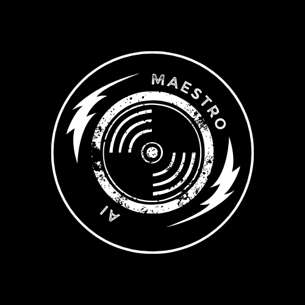
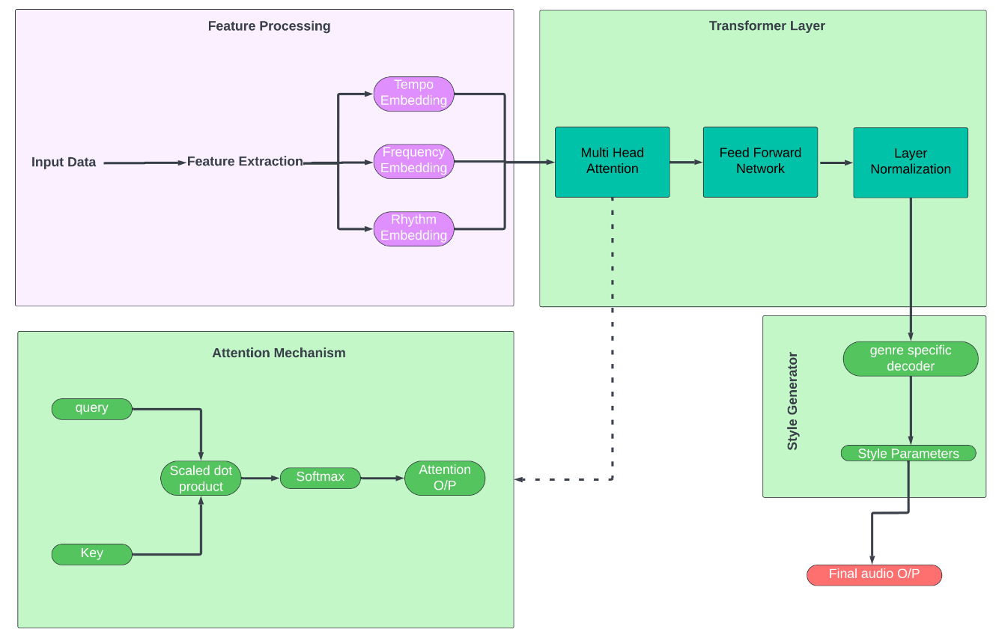
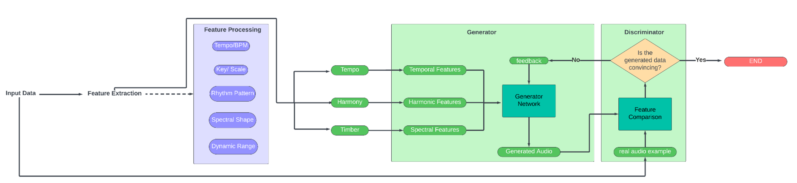

# 🎹 MAESTRO.ai
### Music Analytics & Enhanced Style Transfer Research Optimizer

  

*Transform your audio with cutting-edge AI-powered music production*

[Installation](#installation) •
[Features](#features) •
[Usage](#usage) •
[Documentation](#documentation) •
[Contributing](#contributing)

---

## 🌟 Overview

MAESTRO.ai is a state-of-the-art automated music production system that leverages advanced deep learning techniques to transform and enhance audio tracks. Using WaveNet architectures, GANs, and transformer models, MAESTRO.ai provides professional-grade audio processing with real-time capabilities.

## 🚀 Features

### 🎛️ Audio Generation System
- **WaveNet-Based Processing**
  - Automated mixing optimization
  - Intelligent dynamic range compression
  - Context-aware EQ adjustment
  - Professional reverb/delay effects
- **Real-time Processing Engine**
- **Multi-format Support**

### 🎨 Style Transfer Engine
- **GAN-powered Style Transfer**
- **Genre-specific Processing**
- **Hybrid Genre Creation**
- **Real-time Adaptation**

### 📊 Quality Analysis System
- **Deep Learning Quality Metrics**
- **Production Consistency Checks**
- **Mastering Standards Compliance**
- **Reference Track Comparison**

## 🙏 Acknowledgments

- WaveNet architecture by DeepMind
- Audio processing libraries: librosa, pytorch-audio
- FFmpeg for media handling

---
## Disclaimer

Please respect the copyright of any videos you download. The creator of this program will not be held liable for any copyright violations caused by the usage of this program.